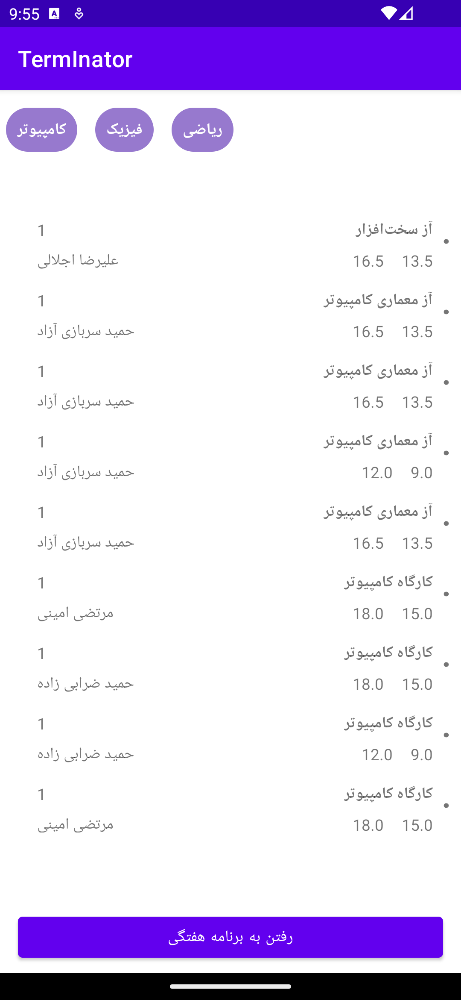
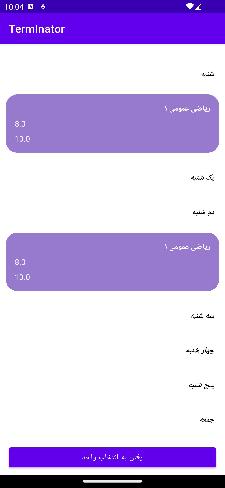
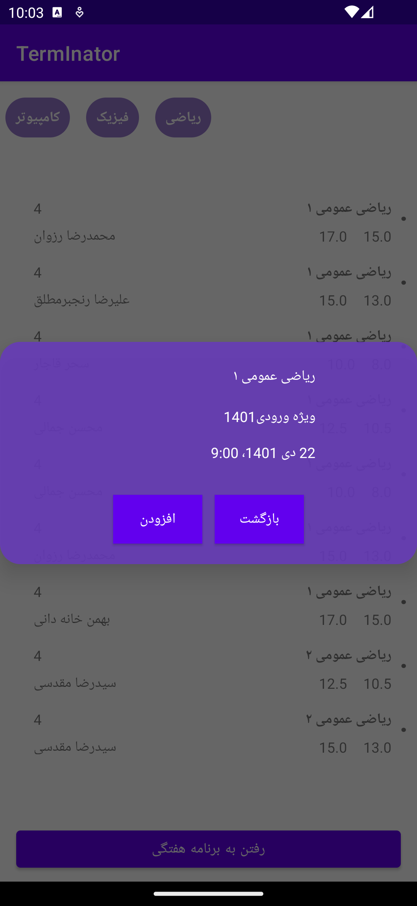

## Hi, Welcome to Terminator

Hesam Asnaashari : 98170635
Ata Rahimzadeh : 98170805


---

## How to start

First, clone the repo:

```
git clone https://github.com/hessamasna/MobilePrograming-TermInator
```

Select your virtual device and click the build button and enjoy!

> Use Android Studio for ease of use

---

## Ui

Application Ui powered by Android Material

---

## Database

Powered by Google Room Database

---

## Requirements

*   SDK: 33 (At least)

## Screenshots







---

> © Hesam Asnaashari, Ata Rahimzadeh   Dec-2022

